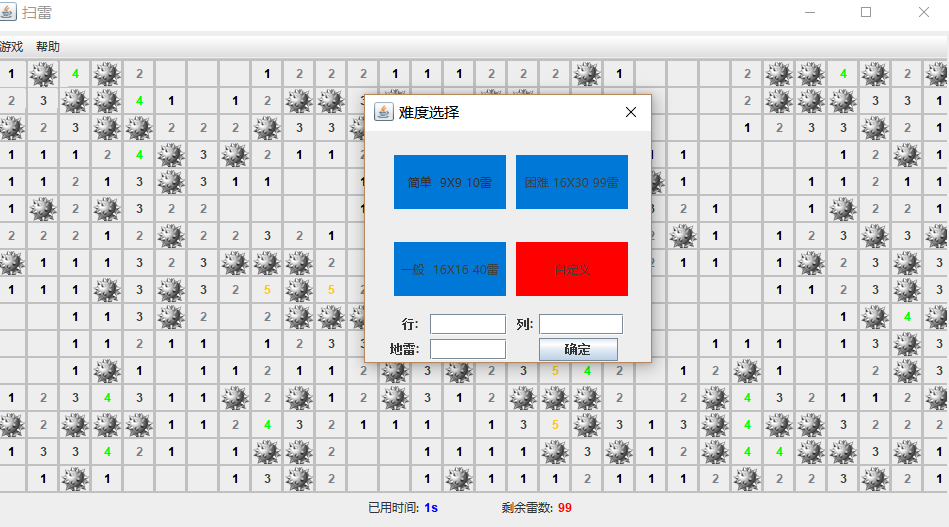
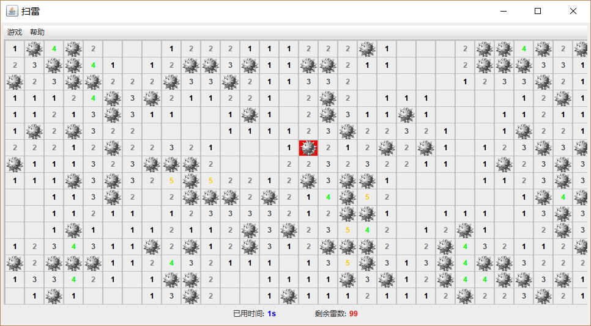

# 扫雷游戏

启动，或者启动xyz.lihang.test.test.main方法
```java
public static void main(String[] args) {
		EventQueue.invokeLater(new Runnable() {
			public void run() {
				try {
					MainWindow frame =MainWindow.getMainWondowInstance();
					frame.setVisible(true);
				} catch (Exception e) {
					e.printStackTrace();
				}
			}
		});
	}

```
界面:
    

    

    

    

